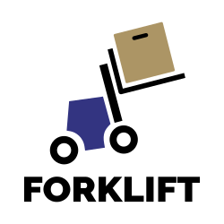

# Forklift documentation

Forklift is an upstream project for migrating VMware virtual machines to KubeVirt.

## Contributing to Forklift documentation

This project is [Apache 2.0 licensed](LICENSE) and accepts contributions via
GitHub pull requests.

See [CONTRIBUTING](CONTRIBUTING.md) for details.

## Building a document preview

You can build a document preview by running a Jekyll container.

You must have Podman installed.

1. Clone the repository:
  ```console
  $ git clone -b source https://github.com/konveyor/forklift-documentation.git && cd forklift-documentation
  ```
2. Create `.jekyll-cache` and `_site` directories:
  ```console
  $ for i in .jekyll-cache _site; do mkdir ${i} && chmod 777 ${i}; done
  ```
3. Create a `Gemfile.lock` file:
  ```console
  $ for i in Gemfile.lock; do touch ${i} && chmod 777 ${i}; done
  ```
4. Run a Jekyll container:
- If your operating system is SELinux-enabled:

  ```console
  $ podman run -it --rm --name jekyll -p 4000:4000 -v $(pwd):/srv/jekyll:Z jekyll/jekyll jekyll serve --watch --future
  ```

  **Note**: The `Z` at the end of the volume (`-v`) relabels the contents so that they can be written from within the container, like running `chcon -Rt svirt_sandbox_file_t -l s0:c1,c2` yourself. You must run this command in the cloned directory.

- If your operating system is not SELinux-enabled:

  ```console
  $ podman run -it --rm --name jekyll -p 4000:4000 -v $(pwd):/srv/jekyll jekyll/jekyll jekyll serve --watch --future
  ```

5. Navigate to `http://<localhost>:4000` in a web browser to view the preview.

## Code of conduct

[](CODE_OF_CONDUCT.md)

## PR preview rendering

[](https://www.netlify.com)
