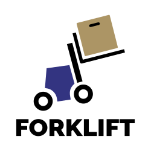

# Forklift documentation

Forklift is an upstream project for migrating virtual machines from VMware, oVirt, OpenStack, OVA, or KubeVirt to KubeVirt.

## Contributing to Forklift documentation

This project is [Apache 2.0 licensed](LICENSE) and accepts contributions via
GitHub pull requests.

See [CONTRIBUTING](CONTRIBUTING.md) for details.

## Building a document preview

### Using a container (recommended)

You need [Podman](https://podman.io/) or [Docker](https://www.docker.com/) installed. No other dependencies are required.

**With Make:**

```console
$ make build          # build the site into _site/
$ make serve          # build and serve at http://localhost:8000
```

**Without Make:**

```console
$ podman build -t forklift-docs-builder .
$ podman run --rm -v "$(pwd)":/docs:Z forklift-docs-builder make build-local
```

To also start a local preview server:

```console
$ podman build -t forklift-docs-builder .
$ podman run --rm -v "$(pwd)":/docs:Z -p 8000:8000 forklift-docs-builder make serve-local
```

Replace `podman` with `docker` if using Docker.

Navigate to `http://localhost:8000` in a web browser to view the preview.

### Building locally (without a container)

You need [Ruby](https://www.ruby-lang.org/) with [Asciidoctor](https://asciidoctor.org/), [Node.js](https://nodejs.org/) (for search indexing), and Python 3 (for the preview server).

Install Asciidoctor:

```console
$ gem install asciidoctor
```

**With Make:**

```console
$ make build-local    # build the site into _site/
$ make serve-local    # build and serve at http://localhost:8000
```

**Without Make:**

```console
$ asciidoctor -b html5 -d book --safe-mode unsafe \
    -a upstream -a build=upstream \
    -a docinfodir="$(pwd)/documentation" -a docinfo=shared \
    -o _site/documentation/doc-Planning_your_migration/master.html \
    documentation/doc-Planning_your_migration/master.adoc

$ npx -y pagefind --site _site --root-selector "#content" --output-subdir _pagefind

$ cd _site && python3 -m http.server 8000
```

Repeat the `asciidoctor` command for each guide (`doc-Migrating_your_virtual_machines`, `doc-Release_notes`).

## Code of conduct

[](CODE_OF_CONDUCT.md)

